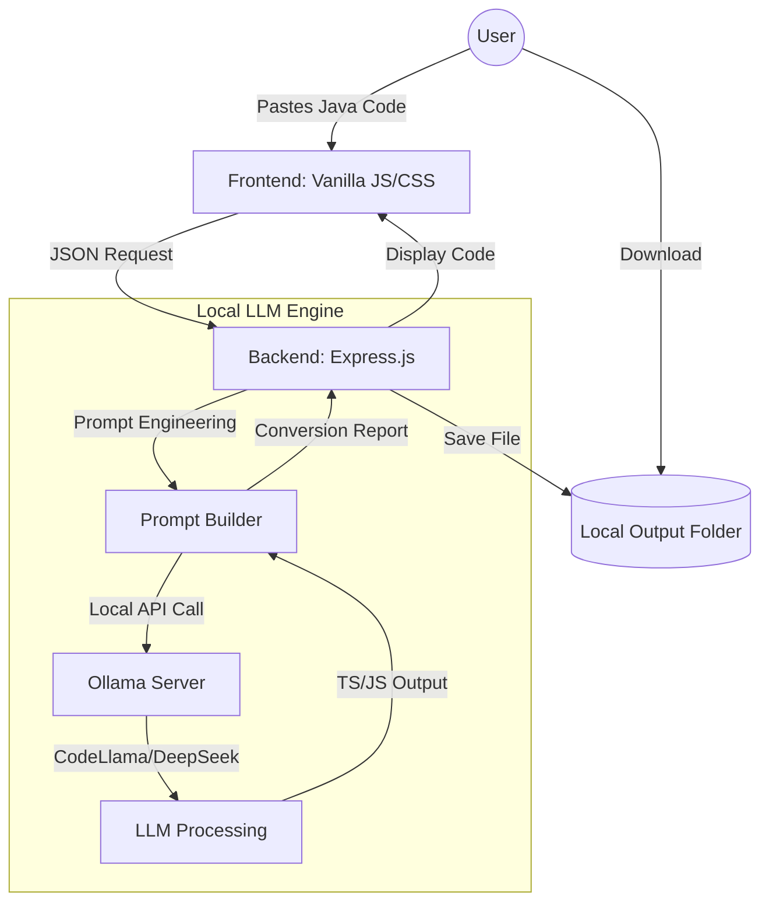

# 🎭 Selenium → Playwright Converter (Local LLM Powered)

[](https://github.com/Gpalak21/SeleniumToPlaywright-LocalLLM)
[](https://ollama.com)
[](LICENSE)


A high-performance, **local LLM-powered** web engine that intelligently transforms legacy Selenium (Java) + TestNG automation suites into modern, high-speed Playwright (JavaScript/TypeScript) scripts.

---

## 🏗️ System Architecture

The following diagram illustrates the secure, local loop conversion process:



---

## 🚀 Key Features

### 🔐 100% Secure & Local
No cloud APIs, no data leaks, and no subscription costs. Your proprietary test logic stays on your machine using **Ollama**.

### 🧠 Intelligent TestNG Mapping
Unlike simple regex converters, this tool understands the **context** of TestNG:
- `@Test` → `test()`
- `@BeforeMethod` → `test.beforeEach()`
- `@AfterMethod` → `test.afterEach()`
- `@DataProvider` → Playwright `test.each()` loops

### ⚡ Hybrid Conversion Engine
Combines **Prompt Engineering** with a strictly defined ruleset (stored in `gemini.md`) to ensure:
- **Auto-waiting** locators (`page.locator`) instead of flaky `Thread.sleep`.
- **Modern Assertions** (`expect(page).toHaveTitle`).
- **Clean Syntax** with proper `async/await` handling.

### 🎭 Developer-First UI
- **Side-by-Side Editors**: Paste on the left, receive on the right.
- **IDE-Style Features**: Line numbering, syntax highlighting, and error reporting.
- **Copy/Download**: Instant access to your converted `.spec.ts` files.

---

## 🛠️ Prerequisites

1. **Node.js**: v18.0.0 or higher.
2. **Ollama**: Installed and running locally ([Download here](https://ollama.com)).
3. **Local Model**: Pull the default model:
   ```bash
   ollama pull codellama
   ```

---

## 📦 Installation & Setup

1. **Clone the Repo**
   ```bash
   git clone https://github.com/Gpalak21/SeleniumToPlaywright-LocalLLM.git
   cd SeleniumToPlaywright-LocalLLM
   ```

2. **Install Dependencies**
   ```bash
   npm install
   ```

3. **Configure Environment**
   Create a `.env` file from the example:
   ```env
   PORT=8080
   OLLAMA_MODEL=codellama
   OLLAMA_BASE_URL=http://localhost:11434
   ```

4. **Launch Application**
   ```bash
   npm run dev
   ```

---

## 🚦 Usage Guide

1. Navigate to `http://localhost:8080`.
2. Ensure the status indicator shows **"codellama ready"** (green).
3. Paste your Selenium Java class.
4. Set your target (TypeScript or JavaScript).
5. Click **⚡ Convert**.
6. Review the conversion report and download your code.

---

## 📜 Mapping Table (Sample)

| Selenium (Java) | Playwright (TS) | Rationale |
| :--- | :--- | :--- |
| `driver.get(url)` | `await page.goto(url)` | Native async navigation |
| `By.id("btn")` | `page.locator("#btn")` | Intelligent locator selection |
| `Assert.assertEquals(a, b)` | `expect(a).toBe(b)` | Modern Chai-style assertions |
| `wait.until(Conditions...)` | `await locator.waitFor()` | Leverages native auto-waiting |

---

## ⚖️ License
This project is licensed under the MIT License - see the `LICENSE` file for details.

---

<p align="center">Made with ❤️ for the Automation Community</p>
